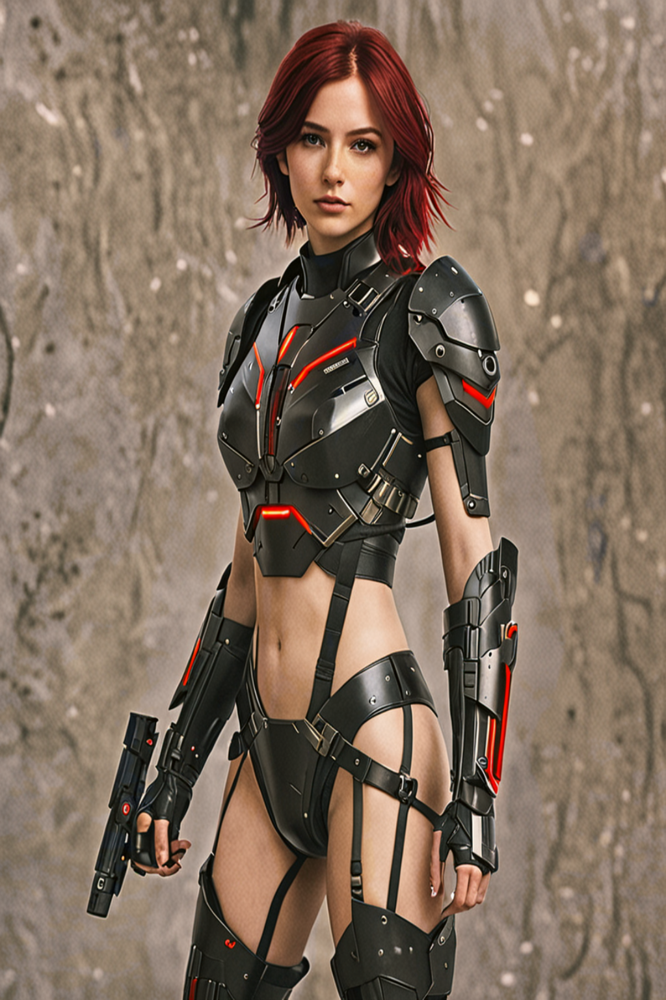
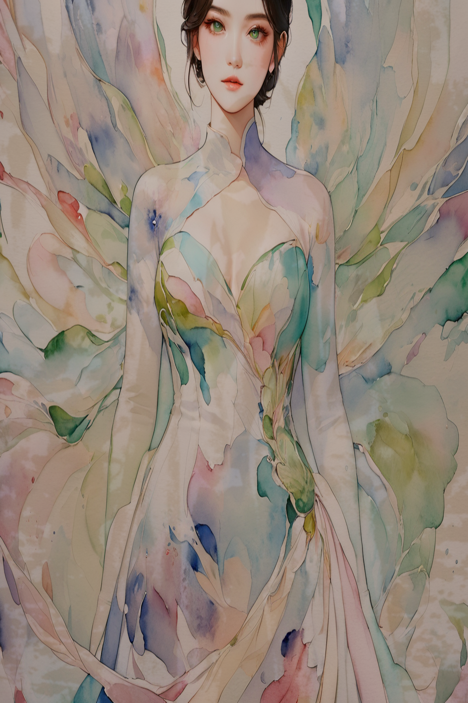

# FaceOrbit - AI 人像生成系统

<div align="center">


一个基于 **ComfyUI + InstantID + SDXL** 的多角度人像生成系统

</div>

---

## 📸 功能特点

### 写真模式 (Portrait Mode)
- **6 个角度**：正面、背面、左四分之三、右四分之三、侧面、顶视
- **两种生成侧重**：
  - 👤 面部优先：保证人物脸部相似度，适用于产品图、证件照
  - 🏃 姿势优先：保证姿态准确性，适用于舞蹈动作、运动场景
- **姿势骨架控制**：通过纯骨架线条图控制生成姿态
- **模板管理**：保存/加载参数配置

### 二次元动漫模式 (Anime Mode)
- **日系动漫风格**：基于 Animagine XL 3.1
- **预设角色库**：100+ 热门动漫角色（火影、海贼、原神等）
- **即选即用**：一键体验预设角色
- **详细操作指南**：提示词规范、参数调优、完整示例

---

## 🖼️ 效果展示

| 风格 | 示例图 |
|:---|:---:|
| 赛博女战士 |  |
| 水彩风格 |  |
| 旗袍风格 |  |
| 电影质感 |  |

> 💡 以上为示例效果，实际生成效果取决于上传照片质量和参数设置

---

## 📁 项目结构

```
FaceOrbit/
├── portrait.py                          # 写真模式主程序
├── anime.py                             # 二次元动漫模式主程序
├── guide_content.py                     # 动漫模式操作指南
├── character_presets.py                 # 动漫角色预设库
├── workflows/
│   ├── portrait_1.json                  # 写真模式 - 姿势优先工作流
│   ├── portrait_2.json                  # 写真模式 - 面部优先工作流
│   └── anime_6angles.json               # 动漫模式工作流
├── user_templates_portrait/             # 写真模式用户模板
├── user_templates_anime/                # 动漫模式用户模板
├── temp/                                # 临时文件
├── output/                              # 输出目录
│   └── jobs/                            # 按任务分组保存
├── front.png                            # 姿态骨架图 - 正面
├── back.png                             # 姿态骨架图 - 背面
├── left.png                             # 姿态骨架图 - 左四分之三
├── right.png                            # 姿态骨架图 - 右四分之三
├── side.png                             # 姿态骨架图 - 侧面
├── top.png                              # 姿态骨架图 - 顶视
├── 赛博女战士cyberpunk_sample.png       # 示例图片
├── 水彩watercolor_sample.png            # 示例图片
├── 旗袍qipao_sample.png                 # 示例图片
├── 电影质感cinema_sample.png            # 示例图片
└── README.md
```

---

## 🚀 快速开始

### 环境要求

- **Python 3.10+**
- **ComfyUI**（已安装 InstantID、ControlNet、IP-Adapter 等插件）
- **必要模型**（放入 ComfyUI 对应目录）：

| 模型 | 存放路径 | 说明 |
|:---|:---|:---|
| `RealVisXL_V5.0_fp16.safetensors` | `models/checkpoints/` | 写真实感模型 |
| `animagine-xl-3.1.safetensors` | `models/checkpoints/` | 二次元动漫模型 |
| `sdxl_vae.safetensors` | `models/vae/` | SDXL VAE |
| `ip-adapter.bin` | `models/instantid/` | InstantID 模型 |
| `diffusion_pytorch_model.safetensors` | `models/controlnet/` | InstantID ControlNet |
| `OpenPoseXL2.safetensors` | `models/controlnet/` | OpenPose ControlNet |

### 安装

1. **克隆项目**
```bash
git clone https://github.com/yourname/FaceOrbit.git
cd FaceOrbit
```

2. **安装依赖**
```bash
pip install gradio pillow requests
```

3. **修改 ComfyUI 路径**
编辑 `portrait.py` 和 `anime.py` 中的：
```python
COMFYUI_INPUT_DIR = "你的 ComfyUI 安装路径/input"
COMFYUI_API = "http://127.0.0.1:8188"
```

### 运行

**写真模式**（端口 7861）：
```bash
python portrait.py
```

**二次元动漫模式**（端口 7862）：
```bash
python anime.py
```

### 准备姿态骨架图（写真模式）

在项目根目录下放置以下 6 张纯骨架线条图（白底彩色线条）：

| 文件名 | 角度 | 特征 |
|:---|:---|:---|
| `front.png` | 正面 | 对称骨骼，面对镜头 |
| `back.png` | 背面 | 背对镜头，肩胛骨可见 |
| `left.png` | 左四分之三 | 身体左转 45°，右肩更宽 |
| `right.png` | 右四分之三 | 身体右转 45°，左肩更宽 |
| `side.png` | 纯侧面 | 身体 90° 侧转，双肩重叠 |
| `top.png` | 俯视 | 头顶视角，肩膀呈圆形 |

---

## ⚙️ 参数说明

### 写真模式

| 参数 | 范围 | 默认值 | 说明 |
|:---|:---|:---|:---|
| 相似度 | 0.5-1.5 | 1.15 | 越高越像上传照片 |
| 姿态控制 | 0.0-0.8 | 0.45 | 越高越遵循姿态参考 |
| 创意度 | 0.4-0.9 | 0.72 | 越高变化越大 |
| 提示词引导 | 4.0-8.0 | 5.5 | 越高越遵循提示词 |
| 采样步数 | 20-50 | 30 | 越高质量越好 |
| 色彩校正 | 0.0-1.0 | 0.5 | 颜色饱和度调整 |

### 动漫模式

| 参数 | 范围 | 默认值 | 说明 |
|:---|:---|:---|:---|
| 相似度 | 0.5-1.0 | 0.8 | 越高越像上传照片 |
| 姿态控制 | 0.0-0.8 | 0.35 | 越高越遵循姿态参考 |
| 创意度 | 0.5-0.9 | 0.7 | 越高变化越大 |
| 提示词引导 | 1.0-10.0 | 6.5 | 越高越遵循提示词 |
| 采样步数 | 20-50 | 28 | 越高质量越好 |
| 色彩校正 | 0.0-1.0 | 0.65 | 颜色饱和度调整 |

---

## 🎯 参数调优指南

| 目标 | 参数调整 |
|:---|:---|
| **更像上传照片** | ↑ 相似度，↓ 创意度 |
| **姿态更准确** | ↑ 姿态控制 |
| **变化更大/更自由** | ↓ 相似度，↑ 创意度 |
| **更贴合提示词** | ↑ 提示词引导 |
| **提高画质** | ↑ 采样步数 |
| **复现结果** | 勾选「固定种子」 |

---

## 📝 提示词语法（动漫模式）

使用 **Danbooru 风格标签**，顺序建议：

```
质量, 数量, 角色名, 作品, 服装, 动作, 表情, 背景, 年代
```

**示例：**
```
masterpiece, best quality, very aesthetic, 1girl, Hatsune Miku, vocaloid, long turquoise hair, school uniform, standing, singing, night concert, newest
```

---

## ❓ 常见问题

### Q: 生成失败，提示无法连接 ComfyUI？
A: 确保 ComfyUI 已启动并添加 `--listen` 参数

### Q: 照片上传后没有反应？
A: 检查照片格式（jpg/png/webp）和大小

### Q: 人物不像本人？
A: 提高「相似度」参数，或更换更清晰的照片

### Q: 动漫模式效果不好？
A: 确保使用的是 Animagine XL 3.1 模型，提示词使用 Danbooru 标签格式

### Q: 背面/侧面姿势不对？
A: 检查骨架图是否正确，或提高「姿态控制」参数

---

## 📄 许可证

MIT License

---

## 🙏 致谢

- [ComfyUI](https://github.com/comfyanonymous/ComfyUI)
- [InstantID](https://github.com/InstantID/InstantID)
- [Animagine XL](https://huggingface.co/cagliostrolab/animagine-xl-3.1)
- [RealVisXL](https://huggingface.co/KwaiVGI/LivePortrait)

---

*最后更新：2026-01-15*